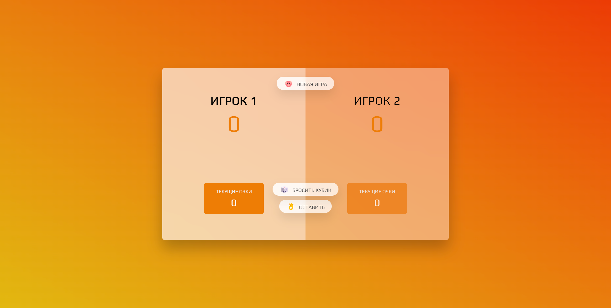

# Игра "Свинья"

**Игра написана на чистом jsvascript.**

**Правила игры:**
- Игроки бросают кубик, тем самым они набирают очки.
- Очки можно сохранить, что бы они не сгорели, но если у игрока **выпадает 1**, тогда все не сохраннные очки сгорают.
- Игра длиться пока один из игроков наберёт **100 очков**.

---

**Ссылка на деплой игры:**
- [Игра "Свинья"](https://banditos86.github.io/pig-game-dice/ 'Игра "Свинья"')

---

**Скриншот игрового поля:**

